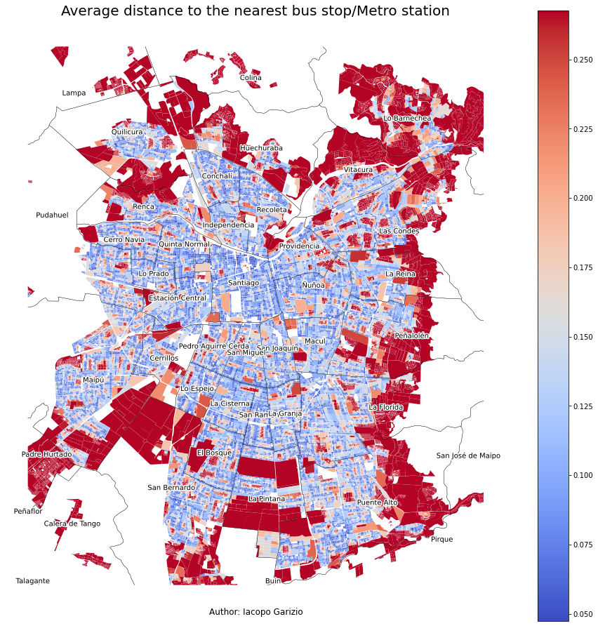

# Who is being left out by public transport?
**An analysis of public transport quality and accessibility in Santiago, Chile**  

Chile is a country with high income inequality. Among OECD members, it has the [highest Gini coefficient](https://data.oecd.org/chart/6dzX) [2017] and the [highest Palma ratio](https://data.oecd.org/chart/6dzY) [2017]. Half of the Chilean workers [earn $564 a month or less](https://www.ine.cl/prensa/2020/10/26/ingreso-laboral-promedio-mensual-en-chile-fue-de-$620.528-en-2019) [2019] and the [richest 1% concentrate 26,5% of the wealth](https://repositorio.cepal.org/bitstream/handle/11362/44395/11/S1900051_es.pdf) [2019].

Having this context in mind, it is no surprise that Santiago (Chile's capital) is highly segregated in terms of income. However, not only income levels are distinctly dispersed across the city, but also parks, health services, high-quality schools, and many others. Because of this, I wanted to analyze **how public transport, another key aspect of urban-life, is distributed, and if there are there any communities that are being underserved**.

# Findings
The average person has to walk 188 meters to get to the nearest bus stop or Metro station, which approximately translates into 3 minutes walking (assuming a conservative speed of 1 m/s)[^1]. However, this number surpasses the 769 meters for the city blocks above the 98th percentile. It is important to notice that many of the city blocks above the 98th percentile pertain to the outskirts.  

On the average city block, a person can access 7.8 different bus routes or Metro lines. However, this is not uniformly distributed across the city. The bottom 1% of city blocks have access to 0 routes or lines and the bottom 5% to only 2, while the top 10% have access to 13.35 or more buses or lines. It should be noted that (as expected from the other maps) the outskirts of the city have the worst connectivity.  

# Conclusion
The analysis has shown that the response to the question **"Who is being left out by public transport?"** depends on what we understand by being *left out*. If we understand being *left out* as having a high distance to the nearest bus stop or Metro station, we see that the outskirts of the city and some dispersed low-connectivity patches are the most underserved.
If we now consider being *left out* as having a low number of buses or routes passing through the nearest stops, then the only areas extremely well-served are the ones near main roads. However, despite the differences in the results obtained by each metric, there is one group that is constantly shown as having the worst quality and accessibility in terms of public transport: the outskirts of the city.

# Methodology and more maps
- Complete analysis: [public_transport_analysis.ipynb](/public_transport_analysis.ipynb)
- Output maps: [images](/images)
